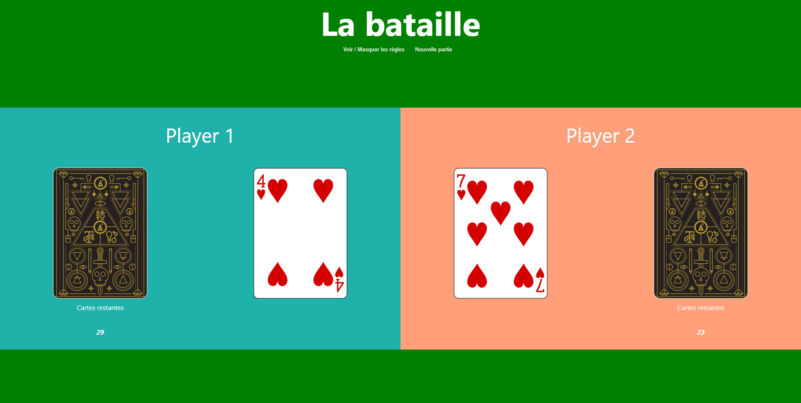

# Battle Card Game

## Table of contents

* What is Battle-Card-Game ?
* How does it work ?
* Stack

### What is Battle-Card-Game ?

Battle-Card-Game is a personnal project. You can play the famous battle game.

### How does it work ?

Click on start button to play.

There are Player1 and Player 2.

Click on the deck player corresponding and face off in a frantic battle !

Enjoy your Battle-Card-Game.

[https://seb-battle.netlify.app](https://seb-battle.netlify.app)

### Stack

Using for the first time Vite.js instead create-react-app.
